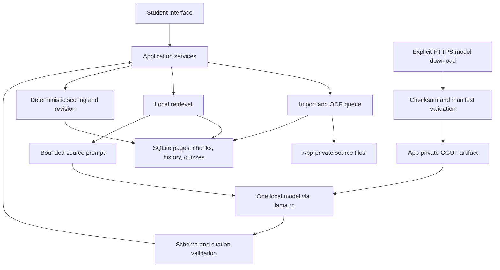

# System architecture

Status: proposed; validate T0 before app scaffolding expands.

## Platform and boundaries

React Native + TypeScript in one shared iOS/Android app. SDK 57 Expo Go supports the interface preview only, with native AI/OCR/PDF disabled. A **development build** is required for llama.rn and platform document adapters. Android ARM64 compilation passed; its runtime remains unverified. The iOS development app passed integrated llama.rn CPU inference, Apple Vision image OCR and PDFKit render-to-OCR on iOS 18.1 Simulator and the physical iPhone 16 Pro / iOS 27.0. Scene support is enabled for iOS 27. Do not extrapolate one synthetic T0 run to general phone support or runtime parity. Standalone disconnected operation is still pending. Use feature folders, not a monorepo of speculative services. Exact dependency pins are in package.json.



Network boundary: model download/install only. No product cloud inference, OCR or embeddings. No backend APIs required. A local in-process service API keeps UI decoupled from adapters.

## Source layout

T1 uses `app/AppShell.tsx` plus typed local routes in `app/routes.ts`; a small state-based native navigator is sufficient for the current flat destinations and Android back behavior. No URL/deep-link router is claimed. Welcome/profile gates entry; notebooks, study, progress, settings and T0 diagnostics are separate feature components. Profile validation lives in domain, initialization in services, SQL access in the SQLite adapter, and migration SQL in db/migrations. Other feature services below remain planned. T0 native checks are preserved under `src/features/diagnostics/T0Screen.tsx` and `src/t0/`.

```text
app/                      Expo routes and composition
src/features/             onboarding, notebooks, study, quizzes, progress, settings
src/domain/               entities, scoring, revision rules
src/services/             import, retrieval, study orchestration, model lifecycle
src/adapters/             sqlite, filesystem, llama, OCR, PDF
src/contracts/            validated request/output types
src/prompts/               versioned task templates
src/db/migrations/        ordered migrations
tests/                    unit, integration and synthetic fixtures
modules/document-reader/ minimal native PDF/OCR bridge if required
```

Prefer Expo SQLite, FileSystem, DocumentPicker and Camera for their supported platform responsibilities. Use a small local Expo native module for bundled ML Kit OCR and Android PDF rendering if no maintained compatible bridge passes T0. Do not adopt a PDF viewer assuming it extracts text. Test direct PDF text extraction separately; page-render-to-OCR is a legitimate local baseline for supported printed pages.

## In-process contracts

- ModelManager: inspect readiness, download/cancel/resume, verify, load/unload.
- ImportService: import file/camera/text → job ID; inspect progress, cancel, approve edited text.
- RetrievalService: search(notebook ID, selected source revisions, question, budget) → bounded evidence.
- StudyService: run(action, evidence, language, conversation ID) → cancellable generation events.
- QuizService: create validated draft, begin attempt, record answer, submit once.
- ProgressService: derive attempt history and topic review queue.

Requests carry IDs. Services return typed errors such as MODEL_NOT_READY, UNSUPPORTED_INPUT, NO_EVIDENCE, INVALID_OUTPUT, STORAGE_FULL, INTERRUPTED. No raw runtime error or stack trace appears in student UI.

## Model lifecycle

Absent → downloading → verifying → ready → loading → loaded; paused/failed states are recoverable. Download into a partial file; use HTTPS and a pinned manifest containing origin, exact revision, filename, byte length, SHA-256, license and required runtime. For resume, check server range support and stable ETag/revision; otherwise restart with notice.

Check available disk including temporary copies and a reserve. Verify full hash before atomic promotion. A manifest must be trusted through the shipped app or signed update, not fetched alongside an arbitrary untrusted URL. Do not accept user-supplied download URLs in V1.

One inference at a time. Cancel cooperatively, release native resources, and pause OCR while generating. On app backgrounding, checkpoint jobs and cancel generation rather than assume unlimited background execution. Reopen detects interrupted work and offers retry. Do not delete a previous verified model until replacement is usable and removal is authorized.

T2 implementation: `ModelManager` owns serialized installation/runtime transitions through injected file/runtime/repository ports. `expo-file-system@57.0.7` supplies foreground download tasks and byte progress; native DocumentReader supplies streaming SHA-256 and same-directory non-overwriting promotion on iOS/Android. Download URLs come only from the bundled T0 manifest. Retry is currently a disclosed restart, not a range/ETag resume claim. Native pause is requested on cancellation; platform-owned temporary bytes may be reclaimed. Unique attempt/final names and persisted checkpoints preserve prior artifacts and allow crash reconciliation without deletion. A process-wide native lease also covers retained T0 AI/OCR paths; unload the teacher before entering diagnostics. Model lifecycle controls live in Settings, separate from the still-unimplemented source-based Study flow. Expo Go disables them. See the build-plan T2 evidence for unverified physical gates.

## Ingestion lifecycle

Selected → copied → extracting → needs review → indexing → ready; failures/cancellation remain visible.

1. Validate file signature, declared format, size/page/pixel limits and notebook ownership.
2. Copy into app-private durable storage; imported picker URIs may be temporary.
3. Compute content hash; offer to reuse identical content within the notebook.
4. Extract page text or render bounded pages and run bundled OCR off the UI thread.
5. Show extracted text and source image/page for correction. Empty/garbled output never becomes ready.
6. Create a new immutable text revision with page provenance.
7. Chunk within page boundaries where possible, preserving headings and offsets.
8. Commit chunks and search index atomically; only then mark ready.
9. On retry use the same job identity and staging revision; no duplicate index entries.

Render one PDF page at a time and release bitmaps. Reject locked/corrupt PDFs with useful instructions. Tables, diagrams, formulas and handwriting may need manual transcription; do not ask a text-only model to interpret raw images.

## Durability, privacy and observability

SQLite owns metadata; files own originals/model weights. Use transactions and foreign keys, prepared statements, ordered migrations, and crash recovery. Exclude study data/model files from automatic platform backup where feasible; verify backup settings in the native build.

App-private storage is not an encryption claim. No analytics upload by default. Local diagnostics contain operation type, timings, error codes, model/prompt versions and byte counts; exclude notes, profile contact data and full prompts. Export diagnostics only through explicit user action with preview.

Document deletion needs confirmation and removes original, text revisions, chunks, search entries, citations and affected generated content according to the data policy. A file deletion job reconciles partial failure. Model output cannot access the filesystem, network, or database directly.

## Threat and failure review

| Risk | Control and test |
|---|---|
| Notes contain “ignore instructions” | Treat as quoted evidence; no tool execution; adversarial fixture |
| Fake citation/answer key | Validate IDs and quotes; evaluate semantic support separately |
| Image/PDF exhausts memory | Limits, downsampling, serial pages, cancellation; stress test |
| Tampered model | Pinned trusted manifest and hash rejection |
| Permission denied/storage full | Preserve existing data, explain next step, support paste input |
| Database migration interrupted | Transactional migration and version check; no silent reset |
| Repeated quiz submit | Unique attempt/submission identity and transaction |
| Sensitive data in logs/backups | Redaction tests and native backup inspection |
| Native build fails offline | Install a standalone release build; no Metro dependency during demo |
